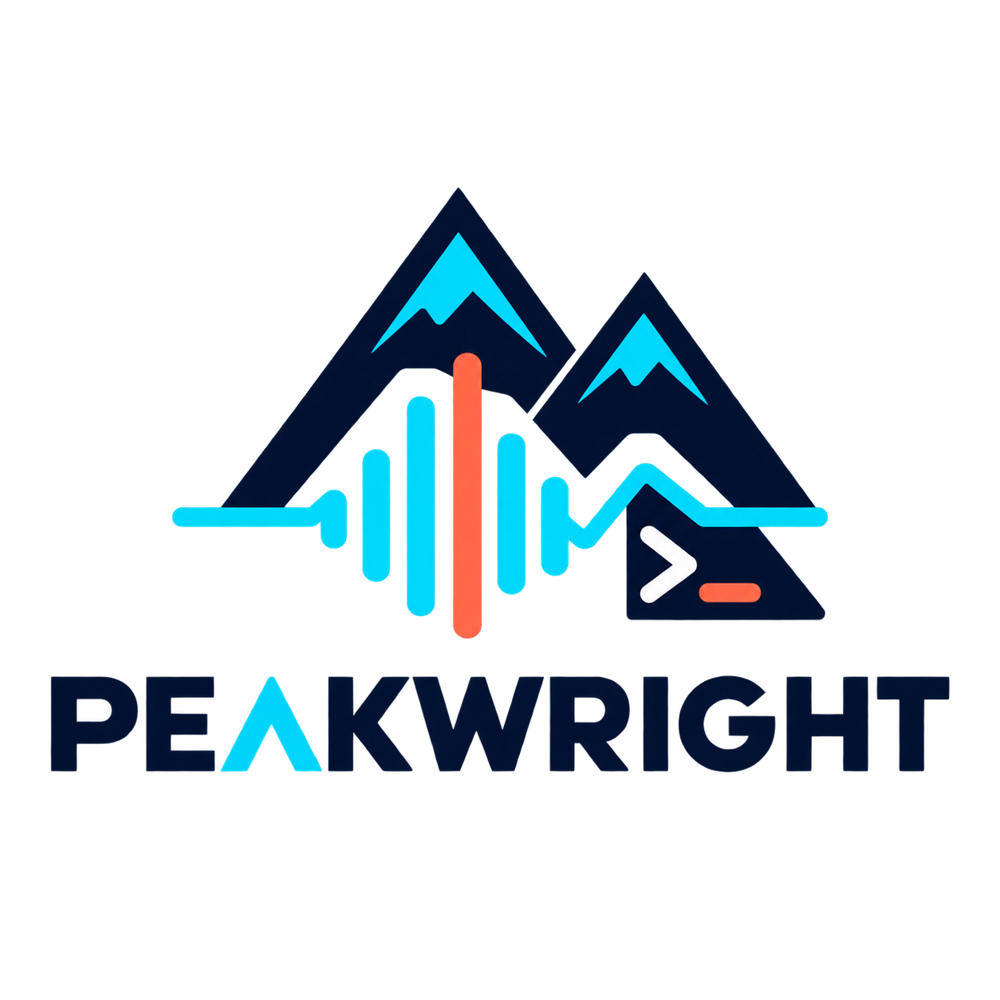

<p align="center">
  
</p>

# Peakwright

[](https://www.npmjs.com/package/@peakwright/node)
[](https://www.npmjs.com/package/@peakwright/node)
[](https://github.com/t4nz/ffmpeg-peaks/actions/workflows/ci.yml)
[](LICENSE)

Generate waveform peak data from audio files, URLs, and Unix pipelines.

**Peakwright is a lightweight alternative with zero third-party runtime dependencies.** Local PCM and IEEE Float WAV files work natively; FFmpeg is an optional fallback for compressed audio, video, URLs, pipes, and format conversion.

## Packages

| Package | Runtime | Purpose |
| --- | --- | --- |
| `@peakwright/core` | Any JavaScript runtime | Portable peak collector |
| `@peakwright/node` | Node.js and Bun | Files, streams, URLs, native WAV and optional FFmpeg |
| `@peakwright/web` | Browsers and web runtimes | `Blob` and `ArrayBuffer` WAV processing |
| `@peakwright/cli` | Node.js and Bun | The `peakwright` command |

Every package contains zero third-party runtime dependencies in its implementation. Workspace packages depend only on other Peakwright packages.

## Features

- Zero runtime npm dependencies and no native Node.js addons.
- Native streaming WAV decoding without FFmpeg.
- Constant-memory peak extraction for long podcasts and videos.
- Local files, remote URLs, and stdin/stdout pipelines.
- Typed Promise API, compatible callback API, and CLI.
- Raw peak arrays or structured output with waveform metadata.
- Merged mono output or separate peaks for each channel.
- Time-range extraction, cancellation with `AbortSignal`, and a configurable FFmpeg binary.

## Format support

| Input | Backend | Additional installation |
| --- | --- | --- |
| Local PCM WAV, 8/16/24/32-bit | Native TypeScript | None |
| Local IEEE Float WAV, 32/64-bit | Native TypeScript | None |
| MP3, AAC, FLAC, Opus, video, URLs, stdin | FFmpeg fallback | [`ffmpeg`](https://ffmpeg.org/download.html) on `PATH` |

Node.js 22 or newer is required. Peakwright also uses FFmpeg when explicit channel or sample-rate conversion is requested.

## Install

```sh
bun add @peakwright/node
```

## Library

```ts
import Peakwright from "@peakwright/node";

const waveform = await new Peakwright({
  width: 1200,
  channelMode: "merge",
}).generate("./audio.ogg", {
  format: "json",
  outputPath: "./waveform.json",
});

console.log(waveform.duration, waveform.data);
```

The callback API remains available for existing integrations:

```ts
new Peakwright().getPeaks("./audio.ogg", (error, peaks) => {
  if (error) throw error;
  console.log(peaks);
});
```

## CLI

```sh
bun add --global @peakwright/cli
peakwright ./podcast.mp3 ./waveform.json --format json --width 1200
```

Peakwright also composes with existing media pipelines:

```sh
ffmpeg -i video.mp4 -f wav - | peakwright - --format json > waveform.json
```

The web package handles WAV natively. FFmpeg WASM is intentionally not bundled; applications that need compressed browser formats can install it separately without increasing the native WAV path.

`ffmpeg-peaks` has been replaced and is deprecated. Existing projects can use its compatibility release temporarily while following the [migration guide](docs/migration.md).

See the [CLI guide](docs/cli.md) for command-line usage and all options.

## Development

```sh
bun install
bun test
bun run check
```

See [CHANGELOG.md](CHANGELOG.md) for releases and [SECURITY.md](SECURITY.md) for vulnerability reporting.

## License

MIT
